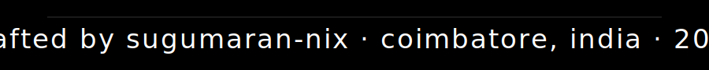

 

  &nbsp;&nbsp;
  &nbsp;&nbsp;
  &nbsp;&nbsp;
  

 

𝑰 ❤️ 𝑩𝒖𝒊𝒍𝒅𝒊𝒏𝒈 𝑨𝑰-𝑷𝒐𝒘𝒆𝒓𝒆𝒅 𝑾𝒆𝒃 𝑨𝒑𝒑𝒔!

:computer: Recent MCA graduate from Anna University (2026), passionate about building things that solve real problems. I enjoy working across the full stack — from training ML models and NLP pipelines to deploying clean React frontends and FastAPI backends.

🎓 Anna University · MCA 2026 &nbsp;|&nbsp; 🐍 Python lover &nbsp;|&nbsp; ⚛️ React builder &nbsp;|&nbsp; 🌏 Coimbatore, India

💡 𝑺𝒕𝒊𝒍𝒍 𝒍𝒆𝒂𝒓𝒏𝒊𝒏𝒈, 𝒂𝒍𝒘𝒂𝒚𝒔 𝒃𝒖𝒊𝒍𝒅𝒊𝒏𝒈. 𝑬𝒙𝒑𝒍𝒐𝒓𝒆 𝒎𝒚 𝒑𝒓𝒐𝒋𝒆𝒄𝒕𝒔 𝒃𝒆𝒍𝒐𝒘.

---

### 𝗣𝗿𝗼𝗷𝗲𝗰𝘁𝘀

<table width="100%" cellspacing="0" cellpadding="0">
  <tr>
    <td width="65%" valign="top" style="padding:16px 20px;background:#0d1117;border:1px solid #30363d;border-right:none;border-radius:6px 0 0 6px;">
      
 fake-job-posting-ml

      
ML classifier that detects fraudulent job postings using NLP, TF-IDF, and ensemble models. Deployed on Render.

      

        
      

      

        
        
        
      

    </td>
    <td width="35%" valign="middle" style="background:#161b22;border:1px solid #30363d;border-left:none;border-radius:0 6px 6px 0;overflow:hidden;">
      
    </td>
  </tr>
</table>

 

<table width="100%" cellspacing="0" cellpadding="0">
  <tr>
    <td width="65%" valign="top" style="padding:16px 20px;background:#0d1117;border:1px solid #30363d;border-right:none;border-radius:6px 0 0 6px;">
      
 ai-content-detector

      
Detects AI-generated text using BERT embeddings and fine-tuned classification. React frontend with FastAPI backend.

      

        
      

      

        
        
        
      

    </td>
    <td width="35%" valign="middle" style="background:#161b22;border:1px solid #30363d;border-left:none;border-radius:0 6px 6px 0;overflow:hidden;">
      
    </td>
  </tr>
</table>

 

<table width="100%" cellspacing="0" cellpadding="0">
  <tr>
    <td width="65%" valign="top" style="padding:16px 20px;background:#0d1117;border:1px solid #30363d;border-right:none;border-radius:6px 0 0 6px;">
      
 Sketchline-whiteboard

      
Real-time collaborative whiteboard with WebSocket sync, live cursors, 10 drawing tools, and undo/redo. Next.js + FastAPI.

      

        
      

      

        
        
        
      

    </td>
    <td width="35%" valign="middle" style="background:#161b22;border:1px solid #30363d;border-left:none;border-radius:0 6px 6px 0;overflow:hidden;">
      
    </td>
  </tr>
</table>

 

<table width="100%" cellspacing="0" cellpadding="0">
  <tr>
    <td width="65%" valign="top" style="padding:16px 20px;background:#0d1117;border:1px solid #30363d;border-right:none;border-radius:6px 0 0 6px;">
      
 ProjectScope

      
AI-assisted project scoping tool that breaks down ideas into actionable plans. Next.js frontend with FastAPI backend.

      

        
      

      

        
        
        
      

    </td>
    <td width="35%" valign="middle" style="background:#161b22;border:1px solid #30363d;border-left:none;border-radius:0 6px 6px 0;overflow:hidden;">
      
    </td>
  </tr>
</table>

---

### 𝗠𝘆 𝗧𝗲𝗰𝗵 𝗦𝘁𝗮𝗰𝗸

**Languages**

**Frontend**

**Backend & APIs**

**AI · ML · NLP**

**Databases**

**Tools & DevOps**

---

### 𝗦𝘁𝗮𝘁𝘀

  

  <picture>
    <source media="(prefers-color-scheme: dark)"  srcset="https://raw.githubusercontent.com/sugumaran-nix/sugumaran-nix/output/github-contribution-grid-snake-dark.svg"/>
    <source media="(prefers-color-scheme: light)" srcset="https://raw.githubusercontent.com/sugumaran-nix/sugumaran-nix/output/github-contribution-grid-snake.svg"/>
    
  </picture>

 

<picture>
  
</picture>
