<!-- MATRIX HEADER — upload matrix-header.svg to repo root -->
<div align="center">
  
</div>

<div align="center">
  
</div>

<div align="center">


</div>

---

## `> whoami`

```
┌──────────────────────────────────────────────────────────────┐
│  [ROOT@sugumaran-nix ~]$  cat /etc/profile                   │
├──────────────────────────────────────────────────────────────┤
│                                                              │
│  name       Sugumaran                                        │
│  alias      sugumaran-nix                                    │
│  location   Coimbatore, India                                │
│  degree     MCA  Anna University  2024-2026                  │
│  email      sugumarankugan@gmail.com                         │
│                                                              │
│  stack      Python  Flask  FastAPI  React.js  TypeScript     │
│  ai         Hugging Face  Scikit-learn  NLP  TF-IDF  NLTK    │
│  db         MySQL  MongoDB  SQLite                           │
│  devops     Docker  Git  GitHub Actions                      │
│                                                              │
│  learning   Deep Learning  DevOps  Google Cloud              │
│  motto      Build. Break. Learn. Repeat.                     │
│                                                              │
└──────────────────────────────────────────────────────────────┘
```

---

## `> ls tech-stack`

**`LANGUAGES`**


**`FRONTEND`**


**`BACKEND`**


**`AI · ML · NLP`**


**`DATABASES`**


**`DEVOPS & TOOLS`**


---

## `> cat stats.json`

<div align="center">
  
  
</div>

<div align="center">
  
</div>

---

## `> git log --graph`

<div align="center">
  
</div>

---

## `> cat projects/featured.md`

| Project | Stack | Highlights |
|:---|:---|:---|
| **[Fake Job Posting ML](https://github.com/sugumaran-nix/fake-job-posting-ml)** | `Flask` `Scikit-learn` `TF-IDF` `Docker` | 4 ML classifiers · Explainable AI · sub-800ms · Dockerized |
| **[AI Text Detector](https://github.com/sugumaran-nix/ai-text-detector)** | `FastAPI` `NLTK` `scikit-learn` `Docker` | 11 NLP features · Sentence highlighting · Zero GPU |
| **[Sketchline Whiteboard](https://github.com/sugumaran-nix/sketchline)** | `FastAPI` `WebSockets` `Next.js 14` `Canvas` | Real-time multiplayer · <100ms latency · Custom engine |
| **[ProjectScope Tasks](https://github.com/sugumaran-nix/projectscope)** | `React` `TypeScript` `Vite` `dnd-kit` | Eisenhower Matrix · Drag-and-drop · Cross-tab sync |

---

## `> ./skill-loader`

```
╔════════════════════════════════════════════════════════════╗
║  [ SUGUMARAN-NIX :: SKILL ACQUISITION LOG ]                ║
╠════════════════════════════════════════════════════════════╣
║  DOCKER   [========--]  80%   containerizing               ║
║  DEEP-ML  [=====-----]  50%   training weights             ║
║  REACT    [=======---]  70%   hooking patterns             ║
║  GCLOUD   [====------]  40%   spinning up                  ║
║  ACTIONS  [======----]  60%   automating ci/cd             ║
╠════════════════════════════════════════════════════════════╣
║  info  ::  Python 3.12 / Node 20 / Docker 26               ║
║  info  ::  MCA uptime: pursuing since Sept 2024            ║
║  warn  ::  sleep() deprecated; coffee.exe detected         ║
╚════════════════════════════════════════════════════════════╝
```

---

## `> cat achievements.log`

| # | Achievement | Details |
|:---:|:---|:---|
| `01` | **API Performance** | Sub-800ms response across all Flask and FastAPI projects |
| `02` | **Docker Deployment** | Containerised ML app with model switching and full unit tests |
| `03` | **Explainable AI** | TF-IDF and heuristics pipeline — fully interpretable, zero black-box |
| `04` | **Web Dev Fundamentals** | Certified — IBM SkillsBuild |
| `05` | **Intro to Generative AI** | Certified — Google Cloud |
| `06` | **Prompt Engineering** | Certified — CognitiveClass.ai IBM |
| `07` | **SQL Basic** | Certified — HackerRank |

---

## `> watch git log --contributions`

<div align="center">
  <picture>
    <source media="(prefers-color-scheme: dark)"
            srcset="https://raw.githubusercontent.com/sugumaran-nix/sugumaran-nix/output/github-contribution-grid-snake-dark.svg"/>
    <source media="(prefers-color-scheme: light)"
            srcset="https://raw.githubusercontent.com/sugumaran-nix/sugumaran-nix/output/github-contribution-grid-snake.svg"/>
    
  </picture>
</div>

---

## `> connect --all`

[](https://linkedin.com/in/sugumaran-nix)
[](https://github.com/sugumaran-nix)
[](mailto:sugumarankugan@gmail.com)

<!-- MATRIX FOOTER — upload matrix-footer.svg to repo root -->
<div align="center">
  
</div>

<div align="center">
  <sub>crafted with python logic and react aesthetics &nbsp;·&nbsp; coimbatore, india &nbsp;·&nbsp; tamil · english</sub>
</div>

<!--
=================================================================
  SNAKE ANIMATION SETUP  (one-time, takes ~5 min)
=================================================================
  Create: .github/workflows/snake.yml

  name: Generate Snake
  on:
    schedule:
      - cron: "0 */12 * * *"
    workflow_dispatch:
  jobs:
    generate:
      runs-on: ubuntu-latest
      steps:
        - uses: Platane/snk@v3
          with:
            github_user_name: sugumaran-nix
            outputs: |
              dist/github-contribution-grid-snake.svg
              dist/github-contribution-grid-snake-dark.svg?palette=github-dark
        - uses: crazy-max/ghaction-github-pages@v3
          with:
            target_branch: output
            build_dir: dist
          env:
            GITHUB_TOKEN: ${ secrets.GITHUB_TOKEN }

  Then: Actions tab > Generate Snake > Run workflow
=================================================================
-->
