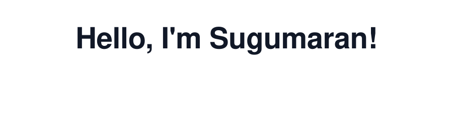

 

MCA graduate (2026) from Anna University, Coimbatore. I build AI/ML models and full-stack web apps — Python, FastAPI, React.
  Currently looking for AI/ML, full-stack, or backend roles — open to full-time or contract. Available immediately, open to remote or relocation in India.

  &nbsp;
  &nbsp;
  &nbsp;
  

---

### Tech Stack

**Languages** 

**Frontend** 

**Backend** 

**AI / ML** 

**Tools & Deploy** 

---

### Projects

<table width="100%" cellspacing="0" cellpadding="0">
  <tr>
    <td style="border:1.5px solid #1E3A8A;border-radius:10px;overflow:hidden;padding:0;">
      
      

        <h3 style="margin:0 0 8px;color:#1E3A8A;">Fake Job Posting Detector</h3>
        
Classifies job postings as fraudulent or legitimate across 17,880 listings. 4 ML classifiers, 87.57% F1-score on an imbalanced dataset. Switch models at runtime without restarting. Includes URL fraud heuristics and feature-level explainability.

        

          
          &nbsp;
          &nbsp;&nbsp;  
        

      

    </td>
  </tr>
</table>

 

<table width="100%" cellspacing="0" cellpadding="0">
  <tr>
    <td style="border:1.5px solid #1E3A8A;border-radius:10px;overflow:hidden;padding:0;">
      
      

        <h3 style="margin:0 0 8px;color:#1E3A8A;">AI Content Detector</h3>
        
Detects AI-written text using 11 NLP signals — perplexity, burstiness, POS entropy, lexical diversity, and more. FastAPI backend with a LinearSVC classifier; sentence-level breakdown highlights exactly which parts read as AI.

        

          
          &nbsp;
          &nbsp;&nbsp;   
        

      

    </td>
  </tr>
</table>

 

<table width="100%" cellspacing="0" cellpadding="0">
  <tr>
    <td style="border:1.5px solid #1E3A8A;border-radius:10px;overflow:hidden;padding:0;">
      
      

        <h3 style="margin:0 0 8px;color:#1E3A8A;">Sketchline — Real-Time Collaborative Whiteboard</h3>
        
Multiplayer whiteboard where strokes sync across all connected users in real time via FastAPI WebSockets. Board state replays on reconnect so late joiners never see a blank canvas — built from scratch without any external drawing library.

        

          
          &nbsp;
          &nbsp;
          &nbsp;&nbsp;  
        

      

    </td>
  </tr>
</table>

---

### GitHub Stats

  <picture>
    <source media="(prefers-color-scheme: dark)"
      srcset="https://github-readme-activity-graph.vercel.app/graph?username=sugumaran-nix&bg_color=00000000&color=9CA3AF&line=4C6EF5&point=4C6EF5&area=true&area_color=4C6EF520&hide_border=true&radius=4"/>
    
  </picture>

