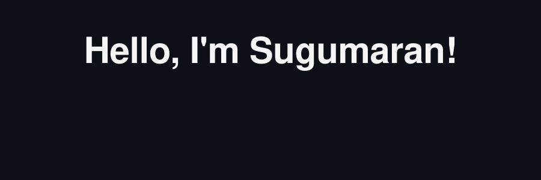

<picture>
  <source media="(prefers-color-scheme: light)" srcset="./header-light.svg">
  <source media="(prefers-color-scheme: dark)" srcset="./header-dark.svg">
  
</picture>

<!--DARK DIVIDER-->
<picture>
  <source media="(prefers-color-scheme: light)" srcset="https://readme-typing-svg.demolab.com?font=monospace&size=1&color=4CAF50&width=900&height=3&lines=─────────────────────────────────────────────────────────────────────────────────────────────────────────────────────────────────────────────────────────────────────────&repeat=false">
  <source media="(prefers-color-scheme: dark)" srcset="https://readme-typing-svg.demolab.com?font=monospace&size=1&color=B22222&width=900&height=3&lines=─────────────────────────────────────────────────────────────────────────────────────────────────────────────────────────────────────────────────────────────────────────&repeat=false">
  
</picture>

 

<!--ABOUT + TECH ARCH-->
<table width="100%" cellspacing="0" cellpadding="0" border="0">
  <tr>
    <!-- LEFT: About -->
    <td width="52%" valign="top" style="padding:20px 28px 20px 0;">
      

        I'm a <strong>Full Stack Developer &amp; AI/ML enthusiast</strong> — MCA graduate from Anna University (2026). 
        I architect systems from model training to production UI, with a focus on building tools that are fast, explainable, and actually useful. 
        Currently open to full-time roles and interesting problems.
      

      

        &nbsp;
        &nbsp;
        
      

      

        
      

    </td>
    <!-- RIGHT: Tech Arch -->
    <td width="48%" valign="top" align="right" style="padding:0;">
      <svg viewBox="0 0 340 320" xmlns="http://www.w3.org/2000/svg" width="340">
        <defs>
          <clipPath id="c0"><circle cx="280" cy="30" r="28"/></clipPath>
          <clipPath id="c1"><circle cx="310" cy="95" r="28"/></clipPath>
          <clipPath id="c2"><circle cx="318" cy="162" r="28"/></clipPath>
          <clipPath id="c3"><circle cx="305" cy="228" r="28"/></clipPath>
          <clipPath id="c4"><circle cx="272" cy="285" r="28"/></clipPath>
          <clipPath id="c5"><circle cx="200" cy="30" r="28"/></clipPath>
          <clipPath id="c6"><circle cx="240" cy="68" r="28"/></clipPath>
          <clipPath id="c7"><circle cx="222" cy="290" r="28"/></clipPath>
          <clipPath id="c8"><circle cx="160" cy="305" r="28"/></clipPath>
        </defs>
        <!-- Arch guide curve (invisible) -->
        <!-- Row 1: top-right -->
        <!-- Python -->
        <circle cx="280" cy="30" r="28" fill="#1F2937" opacity="0.08"/>
        <image href="https://cdn.jsdelivr.net/gh/devicons/devicon/icons/python/python-original.svg" x="252" y="2" width="56" height="56" clip-path="url(#c0)"/>
        <!-- React -->
        <circle cx="310" cy="95" r="28" fill="#1F2937" opacity="0.08"/>
        <image href="https://cdn.jsdelivr.net/gh/devicons/devicon/icons/react/react-original.svg" x="282" y="67" width="56" height="56" clip-path="url(#c1)"/>
        <!-- FastAPI -->
        <circle cx="318" cy="162" r="28" fill="#1F2937" opacity="0.08"/>
        <image href="https://cdn.jsdelivr.net/gh/devicons/devicon/icons/fastapi/fastapi-original.svg" x="290" y="134" width="56" height="56" clip-path="url(#c2)"/>
        <!-- Flask -->
        <circle cx="305" cy="228" r="28" fill="#1F2937" opacity="0.08"/>
        <image href="https://cdn.jsdelivr.net/gh/devicons/devicon/icons/flask/flask-original.svg" x="277" y="200" width="56" height="56" clip-path="url(#c3)"/>
        <!-- Next.js -->
        <circle cx="272" cy="285" r="28" fill="#1F2937" opacity="0.08"/>
        <image href="https://cdn.jsdelivr.net/gh/devicons/devicon/icons/nextjs/nextjs-original.svg" x="244" y="257" width="56" height="56" clip-path="url(#c4)"/>
        <!-- Row 2: second diagonal -->
        <!-- TypeScript -->
        <circle cx="200" cy="30" r="28" fill="#1F2937" opacity="0.08"/>
        <image href="https://cdn.jsdelivr.net/gh/devicons/devicon/icons/typescript/typescript-original.svg" x="172" y="2" width="56" height="56" clip-path="url(#c5)"/>
        <!-- Tailwind -->
        <circle cx="240" cy="68" r="28" fill="#1F2937" opacity="0.08"/>
        <image href="https://cdn.jsdelivr.net/gh/devicons/devicon/icons/tailwindcss/tailwindcss-original.svg" x="212" y="40" width="56" height="56" clip-path="url(#c6)"/>
        <!-- Docker -->
        <circle cx="222" cy="290" r="28" fill="#1F2937" opacity="0.08"/>
        <image href="https://cdn.jsdelivr.net/gh/devicons/devicon/icons/docker/docker-original.svg" x="194" y="262" width="56" height="56" clip-path="url(#c7)"/>
        <!-- MySQL -->
        <circle cx="160" cy="305" r="28" fill="#1F2937" opacity="0.08"/>
        <image href="https://cdn.jsdelivr.net/gh/devicons/devicon/icons/mysql/mysql-original.svg" x="132" y="277" width="56" height="56" clip-path="url(#c8)"/>
      </svg>
    </td>
  </tr>
</table>

<!--DIVIDER-->
<picture>
  <source media="(prefers-color-scheme: light)" srcset="https://readme-typing-svg.demolab.com?font=monospace&size=1&color=4CAF50&width=900&height=3&lines=─────────────────────────────────────────────────────────────────────────────────────────────────────────────────────────────────────────────────────────────────────────&repeat=false">
  <source media="(prefers-color-scheme: dark)" srcset="https://readme-typing-svg.demolab.com?font=monospace&size=1&color=B22222&width=900&height=3&lines=─────────────────────────────────────────────────────────────────────────────────────────────────────────────────────────────────────────────────────────────────────────&repeat=false">
  
</picture>

### Projects

<table width="100%" cellspacing="0" cellpadding="0">
  <tr>
    <td width="65%" valign="top" style="padding:16px 20px;border:1px solid #B22222;border-right:none;border-radius:6px 0 0 6px;">
      

        <h3>Fake Job Posting Detection using ML</h3>
      

      
Job seekers waste time applying to fraudulent listings. This classifier catches them first — benchmarked 4 ML models on 17,880 real-world postings, 87.57% Fraud F1-score on a heavily imbalanced dataset, SHAP-style explainability, runtime model switching. Sub-800ms end-to-end.

      

        
          <svg width="10" height="10" viewBox="0 0 10 10"><circle cx="5" cy="5" r="5" fill="#B22222"><animate attributeName="opacity" values="1;0.3;1" dur="1.8s" repeatCount="indefinite"/></circle></svg>
          live
        
      

      

        
        
        
      

    </td>
    <td width="35%" valign="middle" style="border:1px solid #B22222;border-left:none;border-radius:0 6px 6px 0;overflow:hidden;padding:6px;">
      
    </td>
  </tr>
</table>

 

<table width="100%" cellspacing="0" cellpadding="0">
  <tr>
    <td width="65%" valign="top" style="padding:16px 20px;border:1px solid #B22222;border-right:none;border-radius:6px 0 0 6px;">
      

        <h3>AI Generated Content Detector</h3>
      

      
Statistical classifier that distinguishes human-written from AI-generated text using perplexity, burstiness, and sentence-level variance. Highlights exact spans flagged as machine-generated with per-sentence confidence scores. Served via FastAPI.

      

        
          <svg width="10" height="10" viewBox="0 0 10 10"><circle cx="5" cy="5" r="5" fill="#B22222"><animate attributeName="opacity" values="1;0.3;1" dur="1.8s" repeatCount="indefinite"/></circle></svg>
          live
        
      

      

        
        
        
      

    </td>
    <td width="35%" valign="middle" style="border:1px solid #B22222;border-left:none;border-radius:0 6px 6px 0;overflow:hidden;padding:6px;">
      
    </td>
  </tr>
</table>

 

<table width="100%" cellspacing="0" cellpadding="0">
  <tr>
    <td width="65%" valign="top" style="padding:16px 20px;border:1px solid #B22222;border-right:none;border-radius:6px 0 0 6px;">
      

        <h3>Sketchline — Real-Time Collaborative Whiteboard</h3>
      

      
Collaborative tools break when multiple people draw at once. Sketchline handles it — FastAPI WebSocket backend manages room state, stroke history, and multi-client broadcast via a 7-message-type JSON protocol. Sub-100ms stroke sync, board-state replay on reconnect, live cursor presence at 20 fps. No drawing library.

      

        
          <svg width="10" height="10" viewBox="0 0 10 10"><circle cx="5" cy="5" r="5" fill="#B22222"><animate attributeName="opacity" values="1;0.3;1" dur="1.8s" repeatCount="indefinite"/></circle></svg>
          live
        
      

      

        
        
        
      

    </td>
    <td width="35%" valign="middle" style="border:1px solid #B22222;border-left:none;border-radius:0 6px 6px 0;overflow:hidden;padding:6px;">
      
    </td>
  </tr>
</table>

 

<table width="100%" cellspacing="0" cellpadding="0">
  <tr>
    <td width="65%" valign="top" style="padding:16px 20px;border:1px solid #B22222;border-right:none;border-radius:6px 0 0 6px;">
      

        <h3>ProjectScope — Eisenhower Matrix Task Manager</h3>
      

      
Most task apps dump everything in one list. ProjectScope forces prioritisation — drag-and-drop quadrant layout built in React.js + TypeScript with dnd-kit, keyboard-accessible interactions, cross-tab localStorage sync.

      

        
          <svg width="10" height="10" viewBox="0 0 10 10"><circle cx="5" cy="5" r="5" fill="#B22222"><animate attributeName="opacity" values="1;0.3;1" dur="1.8s" repeatCount="indefinite"/></circle></svg>
          live
        
      

      

        
        
        
      

    </td>
    <td width="35%" valign="middle" style="border:1px solid #B22222;border-left:none;border-radius:0 6px 6px 0;overflow:hidden;padding:6px;">
      
    </td>
  </tr>
</table>

<!--DIVIDER-->
<picture>
  <source media="(prefers-color-scheme: light)" srcset="https://readme-typing-svg.demolab.com?font=monospace&size=1&color=4CAF50&width=900&height=3&lines=─────────────────────────────────────────────────────────────────────────────────────────────────────────────────────────────────────────────────────────────────────────&repeat=false">
  <source media="(prefers-color-scheme: dark)" srcset="https://readme-typing-svg.demolab.com?font=monospace&size=1&color=B22222&width=900&height=3&lines=─────────────────────────────────────────────────────────────────────────────────────────────────────────────────────────────────────────────────────────────────────────&repeat=false">
  
</picture>

### Tech Stack

<table width="100%" cellspacing="0" cellpadding="0">
  <tr>
    <td style="padding:16px 20px;border:1px solid #B22222;border-radius:6px;">
      
Languages

      

        
        
        
        
        
        
      

    </td>
  </tr>
</table>

 

<table width="100%" cellspacing="0" cellpadding="0">
  <tr>
    <td style="padding:16px 20px;border:1px solid #B22222;border-radius:6px;">
      
Frontend

      

        
        
        
        
        
        
      

    </td>
  </tr>
</table>

 

<table width="100%" cellspacing="0" cellpadding="0">
  <tr>
    <td style="padding:16px 20px;border:1px solid #B22222;border-radius:6px;">
      
Backend & APIs

      

        
        
        
        
      

    </td>
  </tr>
</table>

 

<table width="100%" cellspacing="0" cellpadding="0">
  <tr>
    <td style="padding:16px 20px;border:1px solid #B22222;border-radius:6px;">
      
AI · ML · NLP

      

        
        
        
        
        
      

    </td>
  </tr>
</table>

 

<table width="100%" cellspacing="0" cellpadding="0">
  <tr>
    <td style="padding:16px 20px;border:1px solid #B22222;border-radius:6px;">
      
Databases

      

        
        
        
      

    </td>
  </tr>
</table>

 

<table width="100%" cellspacing="0" cellpadding="0">
  <tr>
    <td style="padding:16px 20px;border:1px solid #B22222;border-radius:6px;">
      
Tools & DevOps

      

        
        
        
        
        
        
        
      

    </td>
  </tr>
</table>

<!--DIVIDER-->
<picture>
  <source media="(prefers-color-scheme: light)" srcset="https://readme-typing-svg.demolab.com?font=monospace&size=1&color=4CAF50&width=900&height=3&lines=─────────────────────────────────────────────────────────────────────────────────────────────────────────────────────────────────────────────────────────────────────────&repeat=false">
  <source media="(prefers-color-scheme: dark)" srcset="https://readme-typing-svg.demolab.com?font=monospace&size=1&color=B22222&width=900&height=3&lines=─────────────────────────────────────────────────────────────────────────────────────────────────────────────────────────────────────────────────────────────────────────&repeat=false">
  
</picture>

### By the Numbers

<picture>
  <source media="(prefers-color-scheme: light)" srcset="https://streak-stats.demolab.com?user=sugumaran-nix&hide_border=true&background=00000000&ring=4CAF50&fire=F59E0B&currStreakLabel=4CAF50&sideLabels=1F2937&dates=1F2937&currStreakNum=4CAF50&sideNums=1F2937&stroke=00000000">
  <source media="(prefers-color-scheme: dark)" srcset="https://streak-stats.demolab.com?user=sugumaran-nix&hide_border=true&background=00000000&ring=B22222&fire=F5F5F5&currStreakLabel=B22222&sideLabels=7D8590&dates=7D8590&currStreakNum=B22222&sideNums=F5F5F5&stroke=00000000">
  
</picture>

  <picture>
    <source media="(prefers-color-scheme: light)" srcset="https://github-readme-activity-graph.vercel.app/graph?username=sugumaran-nix&bg_color=00000000&color=1F2937&line=4CAF50&point=F59E0B&area=true&area_color=4CAF5022&hide_border=true&radius=6">
    <source media="(prefers-color-scheme: dark)" srcset="https://github-readme-activity-graph.vercel.app/graph?username=sugumaran-nix&bg_color=00000000&color=7D8590&line=B22222&point=F5F5F5&area=true&area_color=B2222222&hide_border=true&radius=6">
    
  </picture>

<!--DIVIDER-->
<picture>
  <source media="(prefers-color-scheme: light)" srcset="https://readme-typing-svg.demolab.com?font=monospace&size=1&color=4CAF50&width=900&height=3&lines=─────────────────────────────────────────────────────────────────────────────────────────────────────────────────────────────────────────────────────────────────────────&repeat=false">
  <source media="(prefers-color-scheme: dark)" srcset="https://readme-typing-svg.demolab.com?font=monospace&size=1&color=B22222&width=900&height=3&lines=─────────────────────────────────────────────────────────────────────────────────────────────────────────────────────────────────────────────────────────────────────────&repeat=false">
  
</picture>

### Contribution Graph

  <picture>
    <source media="(prefers-color-scheme: dark)" srcset="https://raw.githubusercontent.com/sugumaran-nix/sugumaran-nix/output/pacman-contribution-graph-dark.svg">
    <source media="(prefers-color-scheme: light)" srcset="https://raw.githubusercontent.com/sugumaran-nix/sugumaran-nix/output/pacman-contribution-graph.svg">
    
  </picture>

 

<picture>
  <source media="(prefers-color-scheme: light)" srcset="./footer-light.svg">
  <source media="(prefers-color-scheme: dark)" srcset="./footer-dark.svg">
  
</picture>
